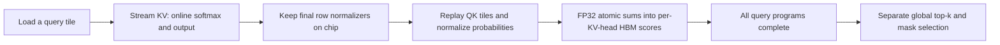

# What the experiment establishes

## Query recency follow-up

The follow-up implements query weights

\[
u_q=\exp(\delta(q-(N-1)))\,\mathbf{1}[q\ge N-w],\qquad
I_k=\|v_k\|_1\sum_q u_q\exp(s_{qk}-L_q).
\]

The window indicator is omitted when `observation_window=0`. Weights apply to
individual query positions, including ragged boundary tiles, rather than to a
query block's start. The attention output retains the original online softmax.
Earlier query programs skip scoring replay when a finite window is selected.
Recent-token reservation is a separate selection constraint inside the budget.

For exponential weights, truncating to the last w queries discards at most
`exp(-decay * w)` of the total query-weight mass. At decay 0.1 and w=128 this
is about 0.000276%, whereas w=32 discards about 4.08%. This bound concerns query
weights, not generation quality or top-k identity: value norms and score margins
also matter. It motivates testing a finite scoring window with exponential
weights after the all-query weighted policy succeeds.

Window scoring adds O(w N d) arithmetic to O(N² d) dense prefill and stores O(N)
importance scalars. Its local tiles are recomputed using final row normalizers;
it retains the two-traversal schedule for scored queries. The actual one-layer
and whole-model measurements are recorded separately in
[the follow-up report](results/FOLLOWUP.md). Parameters are tuned on the same
small pilot, so independent quality validation is still needed for a paper.

## Original all-query metric

For a fixed head, the requested score is

\[
I_k=\|v_k\|_1\sum_q\exp(s_{qk}-L_q),\qquad
L_q=\log\sum_{j\le q}\exp(s_{qj}).
\]

The online softmax state for a query is sufficient to update its output vector
because that entire vector can be rescaled together. A column sum combines
contributions from different queries, each with a different rescaling factor.
Reducing those contributions before their final normalizers are known loses
the information needed to correct the sum.

A two-query causal counterexample has unnormalized weights `[[9, 0], [100, 200]]`.
The true importance for unit value norms is `[4/3, 2/3]`, so key 0 is retained.
The unnormalized column sums are `[109, 200]`, which retain key 1. With a single
query inside one head, dropping its common denominator preserves key ranking.
That shortcut does not extend to arbitrary sums across queries (or differently
normalized heads).

This rejects the proposed accumulation rule, not all possible single-QK-pass
algorithms. For example, storing each query tile's contributions in HBM until
normalization and serially reusing that buffer trades recomputation for traffic
and parallelism. With a fixed query tile it can have linear live storage, but
writes a quadratic amount of attention data over the run. Our implementation
instead recomputes local tiles and avoids writing those contributions to HBM.

The implemented schedule is:

Each replay immediately reduces a probability tile across queries and multiplies
by the value L1 norm. Only the output and one FP32 importance scalar per KV-head
token are stored by the attention kernel. There is no globally resident attention
matrix or per-query importance table. Dense attention arithmetic remains
quadratic in context length.

## Why the quality hypothesis can fail even with correct scores

Uniform causal attention has a particularly transparent score:

\[
I_k/\|v_k\|_1=\sum_{q=k}^{N-1}\frac{1}{q+1}=H_N-H_k
\]

for zero-based key positions. Early tokens receive contributions from many more
queries than late tokens. With equal value norms, pure top-k keeps a prefix.
This is an intrinsic position bias of the specified all-query metric. It does
not imply those tokens are the best predictors of future decode attention.
Reserving recent tokens or changing the query weighting would be different
selection policies and must be evaluated as explicit ablations. The frozen pilot
uses the requested pure top-k score; it does not introduce those changes after
seeing unfavorable results.

The full-cache fused control and historical baseline reproduction checks are
necessary to interpret the negative quality result. They test whether replacing
the prefill computation itself changes generation, and whether the existing
baselines have drifted. They do not establish quality on unseen examples.

## Claim boundaries

* Linear live attention memory is supported by implementation and allocator data.
* Exact importance, up to floating-point error, is supported by materialized and
  analytic references. Exact mask identity is only asserted on tested inputs;
  near-tied scores and FP32 atomic ordering can change top-k membership.
* A single QK traversal, global selection in the same launch, zero scoring cost,
  and linear dense arithmetic are not implemented or claimed.
* SnapKV has observation-window scoring storage O(Nw), which is also linear in
  N for fixed w. The measured advantage is reduced allocations, not a different
  asymptotic order at fixed w.
* MiniKV's selective FlashAttention is relevant prior art, so this experiment
  does not justify a first-ever fused prefill importance claim. See the source
  audit and links in README.md.
